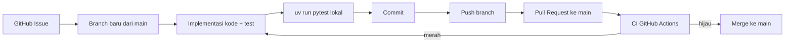

# Demo Vibe Engineering: Setup Proyek → CI/CD dengan AI Agent

Dokumen ini berisi **skrip demo** untuk kelas _vibe engineering_: bagaimana membangun proyek Python dari nol (`uv init`) sampai memiliki pipeline CI/CD yang hijau, **menggunakan kombinasi CLI manual dan prompting ke AI coding agent** (Zed Agent / Claude Code / GitHub Copilot Agent, dll).

Studi kasus didesain **berbeda** dari `challenge-sqa-14` (yang memvalidasi email/password/MySQL untuk registrasi user), tapi memakai **pola yang sama**: validasi input → keamanan (hashing) → integrasi database. Studi kasus di sini adalah:

> **Sistem Validasi & Keamanan Transaksi Perbankan Sederhana**

Setiap langkah ditulis dalam dua bentuk:

- 🖥️ **CLI** — perintah yang dijalankan manual di terminal.
- 🤖 **Prompt** — kalimat yang diketik ke AI agent untuk mencapai hasil yang sama (atau melanjutkan langkah CLI).

Gunakan salah satu (atau kombinasi keduanya) sesuai kebutuhan demo.

---

## 0. Persiapan Repositori GitHub (opsional, di awal)

🖥️ **CLI**

```bash
gh repo create bank-transaksi-sqa --public --clone
cd bank-transaksi-sqa
```

🤖 **Prompt**

```
Buatkan repository GitHub baru bernama "bank-transaksi-sqa" (public),
lalu clone ke folder kerja saya.
```

---

## 1. Inisialisasi Proyek Python dengan `uv`

🖥️ **CLI**

```bash
# Inisialisasi proyek uv (membuat pyproject.toml, main.py, .python-version)
uv init --python 3.12

# Membuat virtual environment
uv venv

# Aktifkan virtual environment
# Windows (PowerShell)
.venv\Scripts\Activate.ps1
# Windows (cmd)
.venv\Scripts\activate.bat
# macOS / Linux
source .venv/bin/activate
```

🤖 **Prompt**

```
Inisialisasi proyek Python baru di folder ini menggunakan `uv init`
dengan Python 3.12, lalu buat virtual environment dengan `uv venv`
dan aktifkan environment tersebut.
```

---

## 2. Menambahkan Dependencies

Proyek ini butuh: web framework (opsional), library hashing, driver MySQL, dan tools testing.

🖥️ **CLI**

```bash
# Dependencies utama
uv add fastapi[standard] bcrypt pymysql

# Dependencies untuk development/testing
uv add --dev pytest pytest-cov httpx
```

🤖 **Prompt**

```
Tambahkan dependencies berikut ke proyek menggunakan `uv add`:
- fastapi[standard], bcrypt, pymysql sebagai dependency utama
- pytest, pytest-cov, httpx sebagai dev dependency

Setelah itu, pastikan `pyproject.toml` dan `uv.lock` terupdate.
```

---

## 3. Membuat Kerangka Kode Awal

🖥️ **CLI**

```bash
# main.py & test_main.py sudah dibuat otomatis oleh `uv init`,
# tapi kita kosongkan/isi kerangka awal secara manual jika perlu.
```

🤖 **Prompt**

```
Buat kerangka awal `main.py` dan `test_main.py` yang masih kosong
(hanya docstring modul), sebagai starting point sebelum fitur-fitur
divalidasi lewat GitHub Issue satu per satu.
```

---

## 4. Membuat CI Workflow untuk `test_main.py`

🖥️ **CLI**

```bash
mkdir -p .github/workflows
```

Lalu isi `.github/workflows/ci.yml`:

```yaml
# .github/workflows/ci.yml
name: SQA Pipeline

on:
  push:
    branches: [main]
  pull_request:
    branches: [main]

jobs:
  test:
    name: Run Unit Tests
    runs-on: ubuntu-latest

    steps:
      - name: Checkout Code
        uses: actions/checkout@v4

      - name: Install uv
        uses: astral-sh/setup-uv@v3
        with:
          version: "latest"
          enable-cache: true
          cache-dependency-glob: "uv.lock"

      - name: Set up Python
        uses: actions/setup-python@v5
        with:
          python-version: "3.12"

      - name: Install Dependencies
        run: uv sync --dev

      - name: Run Tests with Coverage
        run: uv run pytest test_main.py -v --cov=main
```

🤖 **Prompt**

```
Buatkan GitHub Actions workflow di `.github/workflows/ci.yml` bernama
"SQA Pipeline" yang berjalan setiap push dan pull request ke branch
`main`. Workflow harus:
1. Checkout kode
2. Install `uv` (astral-sh/setup-uv@v3) dengan cache aktif
3. Setup Python 3.12
4. Install dependencies dengan `uv sync --dev`
5. Menjalankan `uv run pytest test_main.py -v --cov=main`
```

---

## 5. Commit & Push Setup Awal ke GitHub

🖥️ **CLI**

```bash
git add .
git commit -m "chore: setup awal proyek dengan uv dan CI pipeline"
git branch -M main
git remote add origin https://github.com/<username>/bank-transaksi-sqa.git
git push -u origin main
```

🤖 **Prompt**

```
Commit semua perubahan setup awal proyek (uv init, dependencies, CI
workflow) dengan pesan yang sesuai konvensi Git, lalu push ke branch
`main` di GitHub.
```

---

## 6. Membuat 4 Dokumen Issue + GitHub Issue via Prompting

Buat 4 file dokumen issue di folder `issues/` untuk kasus **transaksi perbankan**. Setiap dokumen lalu didaftarkan sebagai GitHub Issue lewat `gh issue create`
(atau agent).

### 6.1 `issues/1-issue_rekening_validator.md`

````markdown
# [Feature] Penambahan Validasi Nomor Rekening

## Deskripsi

Sistem transaksi perbankan kita memerlukan validasi format nomor
rekening sebelum transaksi diproses, untuk mencegah kesalahan input
di sisi klien maupun percobaan injeksi data yang tidak valid.

## Alur Kerja Git & GitHub Issue

Alur yang harus diikuti: **issue -> branch -> implementasi -> commit -> pull request -> ci -> merge**.

1. **Buat GitHub Issue** menggunakan [GitHub CLI](https://cli.github.com/) (`gh`) berdasarkan dokumen ini:

   ```bash
   gh issue create \
     --title "[Feature] Penambahan Validasi Nomor Rekening" \
     --body-file issues/1-issue_rekening_validator.md \
     --label "feature"
   ```
````

Catat nomor issue yang dihasilkan, lalu gunakan nomor tersebut pada
branch dan pesan commit.

2. **Buat branch baru** dari `main` dengan format
   `feature/issue-<nomor>-rekening-validator`.

## Tugas

1. Buat fungsi `is_account_number_valid(nomor_rekening: str) -> bool` di `main.py`.
2. Nomor rekening dianggap valid jika terdiri dari **10-16 digit angka saja**
   (tanpa spasi, huruf, atau simbol).

## Kriteria Penerimaan SQA (Acceptance Criteria)

Buat _Unit Test_ di `test_main.py` menggunakan `pytest.mark.parametrize`:

- **Positive Case:** `"1234567890"`, `"9876543210123456"` (Harus `True`)
- **Negative Case:** `"12345"` (terlalu pendek), `"12345678901234567"` (terlalu panjang),
  `"12345ABCDE"` (mengandung huruf), `""` (kosong) (Harus `False`)

## Instruksi CI/CD

Jalankan `uv run pytest` di lokal sebelum membuat PR. Pipeline GitHub
Actions harus hijau.

````

### 6.2 `issues/2-issue_nominal_validator.md`

```markdown
# [Feature] Penambahan Validasi Nominal Transaksi

## Deskripsi

Setiap transaksi harus memiliki nominal yang valid: berupa angka
positif dan tidak melebihi batas maksimum transaksi harian.

## Alur Kerja Git & GitHub Issue

Sama seperti issue sebelumnya (issue -> branch `feature/issue-<nomor>-nominal-validator` -> implementasi -> commit -> PR -> CI -> merge).

## Tugas

1. Buat fungsi `is_nominal_valid(nominal: float) -> bool` di `main.py`.
2. Nominal dianggap valid jika:
   - Bertipe numerik dan lebih besar dari `0`.
   - Tidak melebihi `50_000_000` (batas transaksi harian).

## Kriteria Penerimaan SQA (Acceptance Criteria)

Buat _Unit Test_ di `test_main.py` menggunakan `pytest.mark.parametrize`:

- **Positive Case:** `50000`, `50_000_000` (batas atas, Harus `True`)
- **Negative Case:** `0`, `-1000`, `50_000_001` (melebihi batas) (Harus `False`)

## Instruksi CI/CD

Jalankan `uv run pytest` di lokal sebelum membuat PR. Pipeline GitHub
Actions harus hijau.
````

### 6.3 `issues/3-issue_pin_hash.md`

```markdown
# [Security] Implementasi Hashing PIN Transaksi

## Deskripsi

Menyimpan PIN transaksi dalam bentuk _plain text_ adalah celah
keamanan fatal (OWASP Top 10). PIN harus di-_hash_ sebelum disimpan
ke database.

## Alur Kerja Git & GitHub Issue

Sama seperti issue sebelumnya (branch `feature/issue-<nomor>-pin-hash`).

## Tugas

1. Gunakan pustaka `bcrypt` yang sudah ditambahkan ke proyek.
2. Buat fungsi `hash_pin(pin: str) -> str` di `main.py`.
3. Buat fungsi `verify_pin(plain_pin: str, hashed_pin: str) -> bool`.

## Kriteria Penerimaan SQA (Acceptance Criteria)

Buat _Unit Test_ di `test_main.py` untuk memastikan:

- Hasil dari `hash_pin` tidak sama dengan PIN aslinya.
- `verify_pin` mengembalikan `True` jika disuntikkan PIN asli dan hash-nya.
- `verify_pin` mengembalikan `False` jika disuntikkan PIN yang salah.

## Instruksi CI/CD

Jalankan `uv run pytest` di lokal sebelum membuat PR. Pipeline GitHub
Actions harus hijau.
```

### 6.4 `issues/4-issue_insert_transaksi_to_mysql.md`

```markdown
# [Database] Integrasi Penyimpanan Transaksi ke MySQL

## Deskripsi

Setelah nomor rekening & nominal divalidasi dan PIN di-_hash_, data
transaksi harus disimpan ke basis data MySQL yang persisten.

## Alur Kerja Git & GitHub Issue

Sama seperti issue sebelumnya (branch `feature/issue-<nomor>-mysql-transaksi`).

## Tugas

1. Gunakan `pymysql` yang sudah ditambahkan ke proyek.
2. Buat fungsi `simpan_transaksi_ke_db(nomor_rekening: str, nominal: float, hashed_pin: str) -> bool` di `main.py`.
3. Gunakan _Environment Variables_ (`os.getenv`) untuk kredensial database (Host, User, Password, DB Name).
4. Buat/perbarui `docker-compose.yml` untuk memutar container MySQL lokal.

## Kriteria Penerimaan SQA (Integration Testing)

- Buat _fixture_ pytest untuk **Setup** (membuat tabel `transaksi` sementara) dan **Teardown** (menghapus tabel setelah tes).
- Buat tes yang mensimulasikan penyimpanan transaksi dan memverifikasi (via `SELECT`) bahwa data tersimpan dengan benar.
- Perbarui `.github/workflows/ci.yml` agar menggunakan _Service Container_ MySQL.

## Instruksi CI/CD

Jalankan `uv run pytest` di lokal (dengan `docker-compose up -d`)
sebelum membuat PR. Pipeline GitHub Actions harus hijau.
```

### 6.5 Prompt untuk membuat keempat dokumen + GitHub Issue sekaligus

🤖 **Prompt**

```
Buatkan 4 dokumen issue di folder issues/ untuk studi kasus "Sistem
Validasi & Keamanan Transaksi Perbankan Sederhana", dengan pola yang
sama seperti challenge-sqa-14 (feature validasi input, feature
validasi kedua, security hashing, database integration):

1. [Feature] Validasi Nomor Rekening
2. [Feature] Validasi Nominal Transaksi
3. [Security] Hashing PIN Transaksi
4. [Database] Integrasi Penyimpanan Transaksi ke MySQL

Setiap dokumen harus memuat: Deskripsi, Alur Kerja Git & GitHub Issue,
Tugas, Kriteria Penerimaan SQA (dengan pytest.mark.parametrize bila
relevan), dan Instruksi CI/CD — seperti gaya di issues/*.md pada
project challenge-sqa-14.

Setelah dokumen dibuat, buatkan juga GitHub Issue-nya satu per satu
menggunakan `gh issue create --title ... --body-file ... --label ...`
dengan label yang sesuai ("feature", "security", "database"). Buat
label tersebut dulu jika belum ada di repo.
```

---

## 7. Mengerjakan Setiap Issue (Alur Lengkap)

Untuk **setiap** issue di atas:



### 7.1 Prompt generik yang dipakai berulang per issue

Ini adalah **satu kalimat prompt** yang bisa dipakai ulang untuk
mengeksekusi seluruh alur di atas untuk satu issue — inilah inti dari
demo _vibe engineering_:

```
Kerjakan issues/<nomor>-<nama_file>.md

Ikuti alur: buat GitHub Issue dari dokumen tersebut (buat label jika
belum ada), buat branch baru dari main, implementasikan kode dan unit
test sesuai kriteria penerimaan, jalankan `uv run pytest` sampai
lulus, commit, push, buka Pull Request ke main, cek status CI sampai
hijau, lalu merge PR tersebut.
```

Contoh konkret yang dipakai di demo:

```
kerjakan tugas issues/1-issue_rekening_validator.md
kerjakan tugas issues/2-issue_nominal_validator.md
kerjakan tugas issues/3-issue_pin_hash.md
kerjakan tugas issues/4-issue_insert_transaksi_to_mysql.md
```

### 7.2 Prompt lanjutan yang berguna saat demo

Beberapa prompt tambahan yang sering dipakai saat proses berjalan:

```
Cek status CI untuk PR nomor <n>, apakah sudah hijau?
```

```
Ada error di CI karena <deskripsi error>. Analisis root cause-nya
lalu perbaiki.
```

```
Merge PR nomor <n> ke main sekarang.
```

```
Buatkan ringkasan singkat semua issue yang sudah selesai beserta
nomor PR dan status CI-nya.
```

---

## 8. Ringkasan untuk Slide Kelas

| Langkah           | CLI                                                                      | Prompt Setara                                  |
| ----------------- | ------------------------------------------------------------------------ | ---------------------------------------------- |
| Init proyek       | `uv init`                                                                | "Inisialisasi proyek Python dengan uv"         |
| Virtual env       | `uv venv` + activate                                                     | "Buat dan aktifkan virtual environment"        |
| Tambah dependency | `uv add ...`                                                             | "Tambahkan dependency X, Y, Z"                 |
| CI workflow       | tulis `ci.yml` manual                                                    | "Buatkan GitHub Actions workflow untuk pytest" |
| Push ke GitHub    | `git push`                                                               | "Commit dan push ke GitHub"                    |
| Buat issue        | `gh issue create`                                                        | "Buatkan GitHub Issue dari dokumen ini"        |
| Kerjakan issue    | branch → code → test → commit → PR → CI → merge (manual, banyak langkah) | **"Kerjakan issues/N-nama.md"** (satu kalimat) |

Poin penekanan untuk kelas: dengan _vibe engineering_, langkah-langkah
manual yang berjumlah belasan (branch, edit kode, tulis test, commit,
push, buka PR, cek CI, merge) bisa **diringkas menjadi satu instruksi
natural language**, sementara AI agent tetap mengikuti _best practice_
Git/CI/CD yang benar di baliknya.
